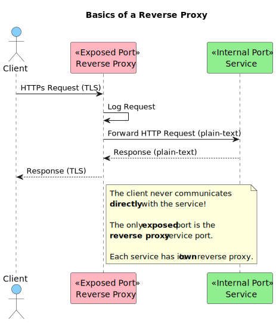

# exposing

This folder contains processes and bash scripts I use to expose services I run in my home server in a secure manner. 

## Reverse Proxy (NGINX)

All services exposed to the Internet are behind a NGINX reverse proxy. Having this proxy allows me to encrypt communication between clients (people) and servers (my services) using HTTPS, and centralize logs about requests that each service receives.

The following diagram visually explains how a reverse proxy works and the reason why it is important:

## Port Forwarding (Router)

To expose a reverse proxy to the Internet, I have to configure my router to forward TCP packets it receives on a specific port (the port that will be exposed) to a port that is exposed in the internal network (port which the reverse proxy is available).

This configuration varies from router to router, but in my case the process is as follows:

1. Open router configuration web platform (`192.168.1.1`)
2. Authenticate
3. Click on settings icon
4. Navigate to Routing Rules > IPV4 Port Mapping
5. Click "New" and again "New"
6. Fill form
    1. Type: `Default`
    2. Application Name: `<service label>`
    3. WAN Name: `Internet`
    4. Internal Host: `<home server IP>`
    5. Protocol: `TCP`
    6. Internal Port: `<reverse proxy port> - <reverse proxy port>`
    7. External Port: `<exposed port> - <exposed port>`
7. Click "Apply"

## Exposing a new Service (Manual)